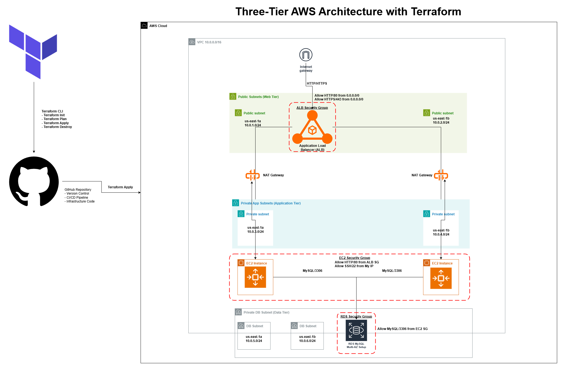

# AWS Three-Tier Modular Infrastructure (Terraform)




A production-grade, highly available three-tier architecture deployed on AWS using Terraform. This project demonstrates modular Infrastructure-as-Code (IaC), VPC isolation, and automated scaling across multiple Availability Zones.

## Architecture Features
- **High Availability**: Multi-AZ deployment across two Availability Zones ensures zero downtime if one zone fails.
- **VPC Segmentation**: 
  - **Public Tier**: Hosts the Application Load Balancer (ALB) and Internet Gateway.
  - **App Tier**: Private subnets hosting the Auto Scaling Group (ASG), accessible only via the ALB.
  - **Database Tier**: Fully isolated private subnets for RDS MySQL, allowing traffic only from the App Tier.
- **Security Group Chaining**: Strict "Least Privilege" rules where each tier acts as a firewall for the next.
- **Dynamic Scaling**: Auto Scaling Group (ASG) manages EC2 instances based on demand.

## Project Structure
- **modules/vpc/**: Networking foundation (VPC, 6 Subnets, NAT Gateways, Route Tables).
- **modules/ec2/**: Compute layer (Security Groups, Launch Template, ASG, Load Balancer).
- **modules/rds/**: Data persistence layer (RDS MySQL Instance, Subnet Groups).
- **root main.tf**: The orchestration layer connecting outputs and inputs between modules.

## Getting Started

### Prerequisites
- AWS CLI configured with admin credentials.
- Terraform v1.0+ installed.

### Installation
1. Clone the repository:
   `git clone https://github.com/Nawaf1208/terraform-aws-three-tier-app.git`
   `cd terraform-aws-three-tier-app`

2. Create a ```terraform.tfvars``` file (This file is ignored by Git for security):
   `project_name = "<PROJECT-NAME>"`
   `db_username  = "<USERNAME>"`
   `db_password  = "<PASSWORD>"`

3. Deployment:
   `terraform init`
   `terraform plan`
   `terraform apply`

## Verification
1. Once the apply is complete, copy the `alb_dns_name` from the outputs.
2. Paste the DNS name into your browser to verify the load balancer is distributing traffic.
3. Login to the AWS Console to view the VPC Resource Map and verify subnet isolation.

## Cleanup
To avoid unwanted AWS costs, destroy all resources when finished:
`terraform destroy`
